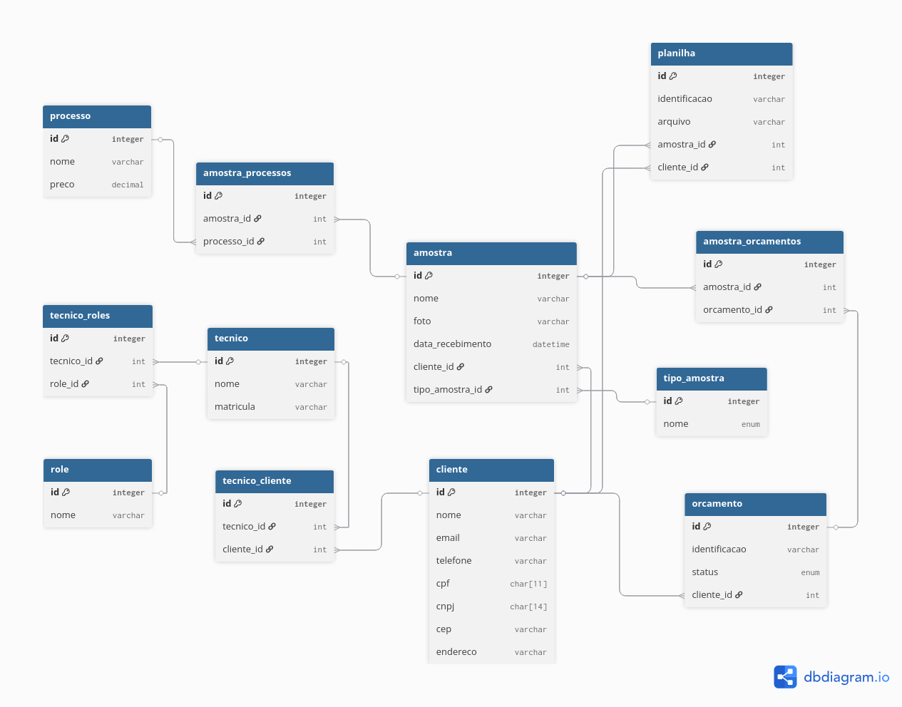

# API - CT Mineral


## Sumário
- [Descrição](#descrição)
- [Tecnologias utilizadas](#tecnologias-utilizadas)
- [Instruções de inicialização da aplicação](#instruções-de-inicialização-da-aplicação)
- [Documentação dos endpoints da API](#documentação-dos-endpoints-da-api)
- [Mecanismo de autenticação](#mecanismo-de-autenticação)
- [Regras de autorização](#regras-de-autorização)
- [Configuração de credenciais de acesso](#configuração-de-credenciais-de-acesso)
- [Exemplos de requisições (Insomnia)](#exemplos-de-requisições-insomnia)
- [Contribuindo](#contribuindo)
- [Autores](#autores)

## Descrição

O sistema desenvolvido consiste em uma API corporativa voltada para a gestão de processos do CT Mineral, permitindo o gerenciamento de usuários, clientes, técnicos, amostras, orçamentos e processos. Além disso, o sistema implementa mecanismos de segurança, incluindo autenticação para identificação dos usuários e autorização baseada em perfis, garantindo que apenas usuários devidamente autorizados possam acessar ou modificar determinados recursos.

## Tecnologias Utilizadas

* **Node.js** – Ambiente de execução JavaScript;

* **AdonisJS** – Framework backend para construção da API;

* **PostgreSQL** – Sistema de gerenciamento de banco de dados relacional;

* **Docker** – Containerização da aplicação;

* **Docker Compose** – Orquestração dos serviços (API e banco de dados).

* **Axios** – Cliente HTTP utilizado para consumo e integração com a API;

* **SUAP** (Sistema Unificado de Administração Pública) – Autenticação institucional via OAuth2;

## Arquitetura
</img>

## Instruções de Inicialização da Aplicação

1. Clone o repositório:

``` 
git clone https://github.com/ctm-systems/ctm-backend
```

2. Acesse a pasta do sistema:

``` 
cd ctm-backend
```

3. Suba a aplicação com Docker Compose:
``` 
docker compose up --build
```

4. Após a inicialização, a API estará disponível em:
```
http://localhost:3333
```

## Documentação dos Endpoints da API

### Endpoints de Autenticação

#### Públicos (sem autenticação)
- **GET /** - Endpoint de verificação de funcionamento
- **GET /auth/url** - Gera URL de autorização OAuth2 para login via SUAP
- **POST /auth/callback** - Processa callback de autenticação do SUAP

#### Autenticados (requer token SUAP)
- **GET /data** - Retorna dados do usuário autenticado
- **GET /logout** - Encerra sessão e remove token

### Endpoints CRUD Principais (Autenticado no sistema)

#### Amostras
- **GET /amostras** - Lista todas as amostras
- **GET /amostras/:id** - Detalhes de uma amostra específica
- **POST /amostras** - Cria nova amostra
- **PUT /amostras/:id** - Atualiza amostra completa
- **PATCH /amostras/:id** - Atualiza amostra parcialmente
- **DELETE /amostras/:id** - Remove amostra

#### Clientes
- **GET /clientes** - Lista todos os clientes
- **GET /clientes/:id** - Detalhes de um cliente específico
- **POST /clientes** - Cria novo cliente
- **PUT /clientes/:id** - Atualiza cliente completo
- **PATCH /clientes/:id** - Atualiza cliente parcialmente
- **DELETE /clientes/:id** - Remove cliente

#### Orçamentos
- **GET /orcamentos** - Lista todos os orçamentos
- **GET /orcamentos/:id** - Detalhes de um orçamento específico
- **POST /orcamentos** - Cria novo orçamento
- **PUT /orcamentos/:id** - Atualiza orçamento completo
- **PATCH /orcamentos/:id** - Atualiza orçamento parcialmente
- **DELETE /orcamentos/:id** - Remove orçamento

#### Planilhas
- **GET /planilhas** - Lista todas as planilhas
- **GET /planilhas/:id** - Detalhes de uma planilha específica
- **GET /planilhas/:id/download** - Download da planilha
- **POST /planilhas** - Cria nova planilha
- **PUT /planilhas/:id** - Atualiza planilha completa
- **PATCH /planilhas/:id** - Atualiza planilha parcialmente
- **DELETE /planilhas/:id** - Remove planilha

#### Processos
- **GET /processos** - Lista todos os processos
- **GET /processos/:id** - Detalhes de um processo específico
- **POST /processos** - Cria novo processo *(role: diretor)*
- **PUT /processos/:id** - Atualiza processo completo *(role: diretor)*
- **PATCH /processos/:id** - Atualiza processo parcialmente *(role: diretor)*
- **DELETE /processos/:id** - Remove processo *(role: diretor)*

#### Técnicos
- **GET /tecnicos** - Lista todos os técnicos
- **GET /tecnicos/:id** - Detalhes de um técnico específico
- **POST /tecnicos** - Cria novo técnico *(role: diretor)*
- **PUT /tecnicos/:id** - Atualiza técnico completo *(role: diretor)*
- **PATCH /tecnicos/:id** - Atualiza técnico parcialmente *(role: diretor)*
- **DELETE /tecnicos/:id** - Remove técnico *(role: diretor)*

#### Tipos de Amostras
- **GET /tipos-amostras** - Lista todos os tipos de amostras
- **GET /tipos-amostras/:id** - Detalhes de um tipo de amostra específico
- **POST /tipos-amostras** - Cria novo tipo de amostra
- **PUT /tipos-amostras/:id** - Atualiza tipo de amostra completo
- **PATCH /tipos-amostras/:id** - Atualiza tipo de amostra parcialmente
- **DELETE /tipos-amostras/:id** - Remove tipo de amostra

### Endpoints de Relacionamentos

#### Cliente-Técnico
- **POST /clientes/:id/adicionar-tecnico** - Associa técnico a cliente
- **POST /clientes/:id/remover-tecnico** - Remove associação técnico-cliente

#### Amostra-Processo
- **POST /amostras/:id/adicionar-processo** - Associa processo a amostra
- **POST /amostras/:id/remover-processo** - Remove associação amostra-processo

#### Orçamento-Amostra
- **POST /orcamentos/:id/adicionar-amostra** - Associa amostra a orçamento
- **POST /orcamentos/:id/remover-amostra** - Remove associação orçamento-amostra

### Níveis de Autorização

#### 🌍 Público
- Endpoint de status e URLs de autenticação

#### 🔐 Autenticado
- Todos os endpoints CRUD
- Endpoints de relacionamentos
- Download de planilhas
- Dados do usuário e logout

#### 👑 Diretor (role: diretor)
- Operações CRUD em técnicos (create, update, delete)
- Operações CRUD em processos (create, update, delete)

### Formato de Resposta

Todos os endpoints retornam JSON com estrutura consistente:

```json
{
  "data": { ... }
}
```

### Códigos de Status HTTP

- **200** - Sucesso geral
- **201** - Recurso criado
- **204** - Sucesso sem conteúdo (delete)
- **400** - Dados inválidos
- **401** - Não autenticado
- **403** - Sem permissão (role insuficiente)
- **404** - Recurso não encontrado
- **422** - Erro de validação
- **500** - Erro interno do servidor

## Mecanismo de Autenticação

O projeto utiliza autenticação OAuth2 via SUAP (Sistema Unificado de Administração Pública) do IFRN.

### Fluxo de Autenticação OAuth2

1. **Geração da URL de Autorização**
   - O endpoint `/auth/url` gera uma URL de autorização OAuth2
   - Redireciona o usuário para o servidor SUAP com os parâmetros necessários

2. **Callback e Troca do Código**
   - O SUAP redireciona para `/auth/callback` com um código de autorização
   - O sistema troca este código por um token de acesso via API do SUAP
   - O token é validado e as informações do usuário são recuperadas

3. **Armazenamento Seguro do Token**
   - O token é armazenado em cookie httpOnly para máxima segurança
   - Configurações do cookie:
     - `httpOnly: true` - Não acessível via JavaScript
     - `secure: true` - Transmitido apenas via HTTPS
     - `sameSite: 'lax'` - Proteção contra ataques CSRF

4. **Validação Contínua**
   - O middleware `AuthSuapMiddleware` valida o token em cada requisição
   - Tokens inválidos são automaticamente removidos
   - Usuários não autenticados recebem status 401

### Endpoints de Autenticação

- `GET /auth/url` - Retorna URL de autenticação com SUAP
- `POST /auth/callback` - Recebe o *code* e faz a troca pelo token
- `GET /data` - Retorna dados do usuário autenticado
- `POST /logout` - Remove o token e encerra a sessão

## Regras de Autorização

O sistema implementa controle de acesso baseado em funções (RBAC - Role-Based Access Control).

### Sistema de Roles

**Roles Disponíveis:**
- `diretor` - Acesso administrativo completo
- `tecnico` - Acesso limitado a operações específicas

### Estrutura de Permissões

1. **Validação de Usuário Local**
   - Após autenticação SUAP, verifica se a matrícula existe na base local
   - Apenas usuários cadastrados na tabela `tecnicos` têm acesso ao sistema

2. **Atribuição de Roles**
   - Roles são atribuídas via relacionamento many-to-many na tabela `tecnico_roles`

3. **Verificação de Permissões**
   - O middleware `RoleMiddleware` verifica se o usuário possui a role necessária

### Níveis de Acesso

**Acesso Autenticado (qualquer usuário logado):**
- Dados do usuário: `GET /data`
- Logout: `POST /logout`
- Listagem de técnicos: `GET /tecnicos`
- Detalhes de técnico: `GET /tecnicos/:id`
- Listagem de processos: `GET /processos`
- Detalhes de processo: `GET /processos/:id`

**Acesso Restrito (role `diretor`):**
- Criar técnico: `POST /tecnicos`
- Atualizar técnico: `PUT/PATCH /tecnicos/:id`
- Deletar técnico: `DELETE /tecnicos/:id`
- Criar processo: `POST /processos`
- Atualizar processo: `PUT/PATCH /processos/:id`
- Deletar processo: `DELETE /processos/:id`

### Fluxo de Autorização

1. **Autenticação via SUAP** - Usuário se autentica usando credenciais institucionais
2. **Validação Local** - Sistema verifica se a matrícula existe na base de dados local
3. **Carregamento de Roles** - Busca as permissões associadas ao usuário
4. **Verificação de Acesso** - Para cada requisição, valida se o usuário possui a role necessária
5. **Resposta** - Permite acesso ou retorna erro 403

### Middleware de Segurança

- `AuthSuapMiddleware` - Valida autenticação OAuth2
- `RoleMiddleware` - Verifica permissões baseadas em roles

## Configuração de Credenciais de Acesso

### Credenciais para Desenvolvimento e Testes

Para testar o sistema, você precisa de credenciais válidas do SUAP (Sistema Unificado de Administração Pública) do IFRN.

### 1. Credenciais de Teste do SUAP

**Para Ambiente de Desenvolvimento:**
- **Credenciais:** Use suas credenciais institucionais do IFRN (matrícula e senha)
- **Tipos de usuário aceitos:**
  - Servidores técnico-administrativos
  - Professores
  - Estudantes (com matrícula válida)

### 2. Configuração OAuth2 no SUAP

Antes de usar o sistema, é necessário registrar a aplicação no SUAP:

1. **Acesse:** https://suap.ifrn.edu.br/o/applications/
2. **Crie uma nova aplicação** com as seguintes configurações:
   - **Client type:** `Confidential`
   - **Authorization grant type:** `Authorization code`
   - **Redirect URI:** `http://localhost:5173/callback` (caso tenha uma aplicação front-end ou deseje pegar o *code* na URL do navegador)
   - **Name:** Nome da sua aplicação (ex: "CTM Backend")

3. **Anote as credenciais geradas:**
   - `Client ID`
   - `Client Secret`

### 3. Configuração das Variáveis de Ambiente

Configure as credenciais no arquivo `.env`:

```bash
# OAuth2 SUAP
SUAP_CLIENT_ID=seu_client_id_aqui
SUAP_CLIENT_SECRET=seu_client_secret_aqui
SUAP_REDIRECT_URI=http://localhost:5173/callback # Caso tenha uma aplicação front-end
```

### 4. Usuários de Teste Pré-configurados

O sistema vem com usuários de teste configurados nos seeders:

**Diretores (Acesso Completo):**
- **Matrícula:** `1886551`
- **Nome:** `Keylly`
- **Roles:** `diretor`

- **Matrícula:** `20241038060006`
- **Nome:** `Jardson`
- **Roles:** `diretor`

- **Matrícula:** `20241038060011`
- **Nome:** `Ian`
- **Roles:** `diretor`

**Técnico (Acesso Limitado):**
- **Matrícula:** `20241038060010`
- **Nome:** `Robério`
- **Roles:** `tecnico`

### 5. Fluxo de Teste Completo

1. **Configure as variáveis de ambiente** com suas credenciais OAuth2
2. **Execute o comando para rodar o Docker:**
```
docker compose up --build
```
4. **Acesse:** GET `http://localhost:3333/auth/url` (para pegar a URL de autenticação) 
5. **Faça login com suas credenciais do SUAP**
6. **Na URL da tela de callback:** `http://localhost:5173/callback` (pegue o *code* que está na URL)
7. **Na URL de callback da API:** POST `http://localhost:3333/auth/url` (passe o *code* como payload)
```
{
  "code": "coloque_aqui_o_code"
}
```
8. **Verifique se sua matrícula está cadastrada** no sistema local

### 6. Solução de Problemas Comuns

**Erro 403 após login:**
- Verifique se sua matrícula está cadastrada na tabela `tecnicos`
- Adicione sua matrícula via seeder

**Erro de OAuth2:**
- Verifique se as credenciais `SUAP_CLIENT_ID` e `SUAP_CLIENT_SECRET` estão corretas
- Confirme se a `SUAP_REDIRECT_URI` está registrada no SUAP

**Token inválido:**
- Limpe os cookies do navegador
- Refaça o processo de login

### 7. Credenciais para Produção

**Para ambiente de produção:**
- Registre uma nova aplicação OAuth2 no SUAP com a URL de produção
- Use variáveis de ambiente seguras
- Configure HTTPS obrigatório
- Atualize a `SUAP_REDIRECT_URI` para o domínio de produção

## Exemplos de Requisições (Insomnia)

### Gerar URL de autenticação

* Método: **GET**
* URL:

```
http://localhost:3333/auth/url
```

A resposta retornará uma URL.

* Copie a URL retornada
* Abra no navegador
* Faça login com:

  * Matrícula: [Sua matrícula]
  * Senha: [Senha do SUAP]

### Obter o código de autenticação

Após o login, você será redirecionado para uma URL semelhante a:

```
http://localhost:5173/callback?code=XXX
```

</img>

* Copie o valor do parâmetro `code`

### Validar o código e gerar token

Caso o código expire realize os passos anteriores para obter um novo código

* Método: **GET**
* URL:

```
http://localhost:3333/auth/callback
```

* Payload - Body (JSON):

```json
{
  "code": "SEU_CODIGO"
}
```

📌 Após a requisição:

* Vá até a aba **Cookies** no Insomnia
* Copie o valor do cookie:

  * **Key**: `suap_token`

### Configurar cookie manualmente no Insomnia

Em **Manage Cookies**, adicione:

* **Key**: `suap_token`
* **Value**: `SEU_TOKEN`
* **Path**: `/`
* **Domain**: `localhost`

Isso garantirá que as próximas requisições estejam autenticadas.

## Testes de Permissão (Usuário logado como Diretor)

### Listar técnicos

* Método: **GET**
* URL:

```
http://localhost:3333/tecnicos
```

* Escolha o `ID` de algum técnico retornado

### Deletar técnico (permitido para diretor)

* Método: **DELETE**
* URL:

```
http://localhost:3333/tecnicos/ID
```

O diretor possui permissão para deletar técnicos.

### Atualizar técnico (alterar papel)

* Método: **PUT**
* URL:

```
http://localhost:3333/tecnicos/SEU_ID
```

* Payload - Body (JSON):

```json
{
  "nome": "seu_nome",
  "matricula": "sua_matricula",
  "role_nome": "tecnico"
}
```

### Teste de restrição de permissão

Após alterar seu próprio papel para `tecnico`:

* Tente executar novamente:

```
DELETE http://localhost:3333/tecnicos/ID
```

Resultado esperado:

* Acesso **negado**, comprovando o funcionamento do controle de permissões (RBAC).

## Contribuindo
1. Faça um fork do projeto;
2. Crie uma branch (`git checkout -b minha-feature`);
3. Commit suas mudanças (`git commit -m 'Adiciona minha feature'`);
4. Envie para o repositório (`git push origin minha-feature`);
5. Abra um Pull Request.

## Autores
[](https://github.com/Barr0ca) [](https://github.com/jardsonalan) [](https://github.com/uluscaz-ifrn) [](https://github.com/roberio-junior)
